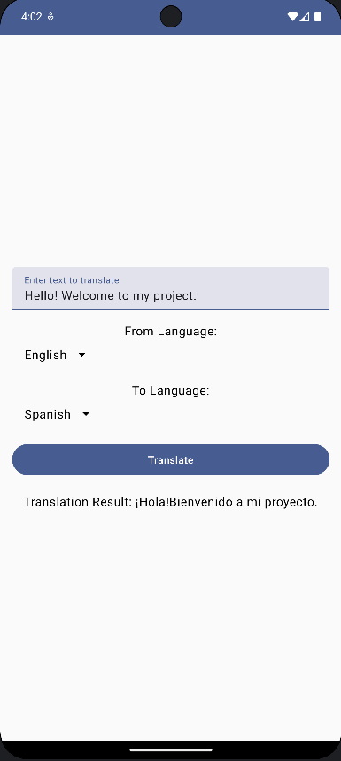
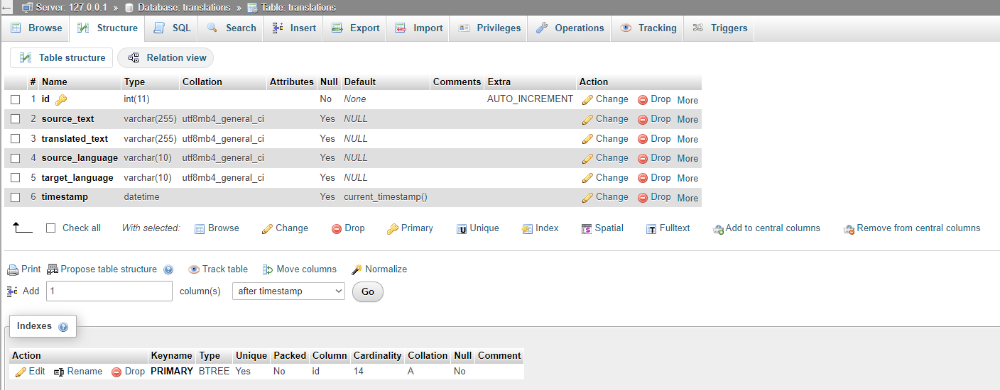

# Translation_App

A language translation app developed using Android's Jetpack Compose for the front-end and a Flask server for the back-end, including integration with a MySQL database.

## Features

- Translate text from one language to another.
- Intuitive and user-friendly interface.
- Backend integration with Flask and MySQL for managing translations.

## Screenshots

### App Interface

### Flask Server and Database Structure

## Setup and Installation

To get the project running on your local machine, follow these steps:

1. Clone the repository:
git clone https://github.com/baranturken/Translation_App.git

2. Navigate to the project directory:
cd Translation_App

3. Install dependencies (ensure you have Python installed):
pip install -r requirements.txt

4. Run the Flask server:
python flask_server/flaskServer.py

## Contributing

Contributions are welcome! Please feel free to submit a Pull Request.

## License

This project is licensed under the MIT License - see the [LICENSE](LICENSE) file for details.

